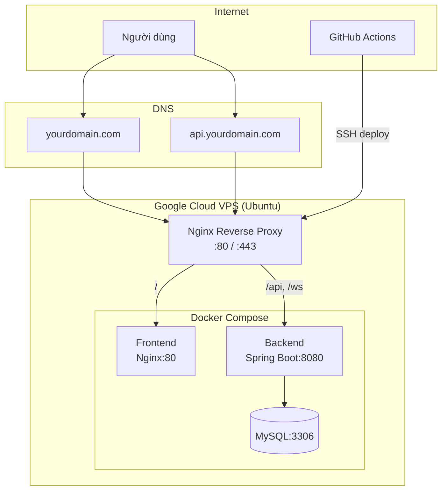

# Phân Tích Tổng Hợp: Deploy Docker + Linux + Google Cloud + Domain + CI/CD

## 📋 Tóm tắt 2 plan hiện có

### Plan 1: [DEPLOY_DOCKER_LINUX_DOMAIN_PLAN.md](file:///d:/2A2026/bookwebsite/ONLINE-STORY-READING-WEBSITE/DEPLOY_DOCKER_LINUX_DOMAIN_PLAN.md) — Hạ tầng Deploy
Đây là plan **chính** cho triển khai production, bao gồm:
- Kiến trúc Docker Compose đầy đủ (MySQL, Qdrant, Ollama, Backend, Frontend, Proxy)
- Dockerfile cho Backend (Spring Boot multi-stage) và Frontend (Vite + Nginx)
- Reverse proxy Nginx + SSL Let's Encrypt
- Domain + DNS setup
- Quy trình deploy + rollback + backup

### Plan 2: [OPTIONAL_AI_DEV_PROD_PLAN.md](file:///d:/2A2026/bookwebsite/ONLINE-STORY-READING-WEBSITE/OPTIONAL_AI_DEV_PROD_PLAN.md) — Tối ưu Production (tắt AI)
Plan **bổ sung** để giảm tải VPS production:
- Feature flags: `APP_FEATURES_VECTOR_SEARCH_ENABLED` / `APP_FEATURES_AI_CHAT_ENABLED`
- Fallback search sang MySQL FULLTEXT khi tắt Qdrant
- Ẩn ChatBox AI trên production
- Loại bỏ container Qdrant + Ollama trên VPS nhỏ

---

## ✅ Những gì ĐÃ LÀM (trạng thái hiện tại)

| Hạng mục | Trạng thái |
|---|---|
| Dockerfile Backend (Spring Boot) | ✅ Đã tạo |
| Dockerfile Frontend (Vite + Nginx) | ✅ Đã tạo |
| [docker-compose.prod.yml](file:///d:/2A2026/bookwebsite/docker-compose.prod.yml) | ✅ Đã tạo & Loại bỏ Qdrant/Ollama |
| [.env.example](file:///d:/2A2026/bookwebsite/.env.example) | ✅ Đã tạo chuẩn cho prod |
| Frontend: bỏ hardcode localhost | ✅ Đã sửa |
| Backend: externalize config sang env vars | ✅ Đã sửa |
| CORS/WebSocket config production | ✅ Đã sửa |
| [.github/workflows/ci.yml](file:///d:/2A2026/bookwebsite/.github/workflows/ci.yml) | ✅ Đã tạo (FE build + BE test + compose config) |
| `.dockerignore` cho BE/FE | ✅ Đã tạo |
| Feature flags backend (tắt AI/Vector) | ✅ Đã implement |
| Fallback `HybridSearchService` | ✅ Đã xử lý (về MySQL) |
| Fallback `ChatbotService` | ✅ Đã xử lý |
| Frontend ẩn `ChatBox` khi AI tắt | ✅ Đã sửa |
| GitHub Actions deploy workflow (`deploy-prod.yml`)| ✅ Đã cấu hình |
| Cấu hình Nginx reverse proxy + server_name | ✅ Đã cấu hình (cho `alexdev.software`) |

## ❌ Những gì CHƯA LÀM (Cần thực hiện thủ công)

| Hạng mục | Mức ưu tiên |
|---|---|
| **Cấu hình Google Cloud VPS (reserve IP, firewall)** | 🔴 Chưa làm |
| **Cấu hình domain Cloudflare (DNS, bật SSL Full)** | 🔴 Chưa làm |
| **Thiết lập GitHub Secrets cho Actions** | 🔴 Chưa làm |
| **Deploy lần đầu lên VPS** | 🔴 Chưa làm |
| **Backup/Monitoring setup** | 🟡 Trung bình |

---

## 🏗️ Kiến trúc đề xuất cho Google Cloud VPS

> [!IMPORTANT]
> Với VPS nhỏ (2 vCPU, 4GB RAM), **nên tắt Qdrant + Ollama** trên production để tiết kiệm tài nguyên. Chỉ cần 3 container: MySQL, Backend, Frontend + Nginx proxy.

---

## 📊 Đánh giá chi tiết 2 Plan

### Điểm mạnh
- **Plan Deploy** rất chi tiết, có đủ Dockerfile, compose, Nginx config, SSL, backup
- **Plan AI** phân tích đúng vấn đề: Qdrant + Ollama tốn RAM, VPS nhỏ nên tắt
- CI cơ bản đã hoạt động (build FE, test BE, validate compose)
- Code đã được chuẩn bị tốt cho production (env vars, không hardcode localhost)

### Điểm cần bổ sung cho mục tiêu của bạn

#### 1. Google Cloud VPS — Plan chưa đề cập cụ thể
Plan hiện chỉ nói chung VPS Linux. Cần bổ sung:
- Tạo VM instance trên GCP (Compute Engine)
- Cấu hình firewall rules trên GCP Console
- Reserve static IP
- Dùng GCP DNS hoặc external DNS

#### 2. CI/CD GitHub Actions — Chỉ có CI, chưa có CD
File [ci.yml](file:///d:/2A2026/bookwebsite/.github/workflows/ci.yml) hiện tại chỉ:
- Build frontend
- Test + package backend
- Validate compose config

**Thiếu hoàn toàn phần CD (Continuous Deployment):**
- Build & push Docker images lên registry (GitHub Container Registry hoặc GCP Artifact Registry)
- SSH vào VPS để pull images mới
- Restart containers
- Health check sau deploy
- Rollback khi fail

#### 3. Reverse Proxy + SSL — Chỉ có plan, chưa có file thật
- Chưa tạo file `deploy/nginx/conf.d/app.conf`
- Chưa tạo certbot config
- Chưa có HTTPS server block trong Nginx

#### 4. [docker-compose.prod.yml](file:///d:/2A2026/bookwebsite/docker-compose.prod.yml) cần chỉnh
Hiện tại vẫn có Qdrant + Ollama + `depends_on` tương ứng. Cần:
- Bỏ service `qdrant`, `ollama`
- Bỏ `depends_on` tương ứng ở backend
- Bỏ volumes `qdrant_storage`, `ollama_data`
- Thêm service `proxy` (Nginx reverse proxy)
- Thêm feature flag env vars

---

## 🗺️ Lộ trình thực hiện đề xuất (hợp nhất 2 plan)

### Phase 1: Chuẩn bị code (trước khi lên server) — ✅ Đã hoàn thành
1. ~~**Implement feature flags backend** — tắt AI/Vector cho production~~
2. ~~**Sửa `HybridSearchService`** — fallback MySQL FULLTEXT~~
3. ~~**Sửa `ChatbotService`** — trả message fallback~~
4. ~~**Frontend ẩn ChatBox** khi `VITE_ENABLE_AI_CHAT=false`~~
5. ~~**Chỉnh docker-compose.prod.yml** — bỏ Qdrant/Ollama~~
6. ~~**Tạo file Nginx reverse proxy** thật với domain `alexdev.software`~~
7. ~~**Tách cấu hình môi trường chuẩn** qua `.env.example`~~
8. ~~**Verify local** — build FE, package BE, docker compose config~~

### Phase 2: Setup Google Cloud VPS
1. Tạo VM (e2-small / e2-medium, Ubuntu 22.04 LTS)
2. Reserve static external IP
3. Cấu hình GCP VPC firewall: allow SSH(22), HTTP(80), HTTPS(443)
4. SSH vào VM, cài Docker + Compose

### Phase 3: Domain + DNS (Cloudflare)
1. Đăng nhập Cloudflare, thêm domain `alexdev.software`
2. Đổi nameservers về Cloudflare
3. Trỏ DNS A record: `@` và `www` → VPS IP (Bật Proxied ☁️)
4. Cấu hình SSL/TLS Mode: **Full**

### Phase 4: Deploy lần đầu (CI/CD GitHub Actions)
1. ~~Tạo `deploy-prod.yml` — workflow deploy SSH vào server~~ (✅ Đã cấu hình)
2. Setup GitHub secrets: `VPS_HOST`, `VPS_USER`, `VPS_SSH_KEY`
3. Push/trigger GitHub Actions trên branch `main`
4. Cài đặt biến thật trong file `.env` trên VPS trước khi container chạy
5. Smoke test end-to-end

### Phase 6: Vận hành
1. Auto-renew SSL cert (cron)
2. Backup MySQL hàng ngày
3. Log rotation
4. Monitoring cơ bản

---

## 💰 Chi phí ước tính Google Cloud

| Hạng mục | Chi phí/tháng |
|---|---|
| VM e2-medium (2 vCPU, 4GB RAM) | ~$25-35 |
| Static IP | ~$3 (khi VM đang chạy: miễn phí) |
| Disk 20GB SSD | ~$3.40 |
| Domain (.com) | ~$10-15/năm |
| SSL (Let's Encrypt) | Miễn phí |
| **Tổng** | **~$30-40/tháng** |

> [!TIP]
> GCP có free tier cho VM e2-micro (2 vCPU shared, 1GB RAM) ở một số region (us-west1, us-central1, us-east1). Nhưng 1GB RAM quá ít cho Spring Boot + MySQL + Nginx. Nên dùng e2-small (2GB) hoặc e2-medium (4GB).

---

## ❓ Câu hỏi cần bạn quyết định

1. **Bạn đã có Google Cloud account chưa?** Hay cần hướng dẫn tạo mới?
2. **Bạn đã có domain chưa?** Nếu có, domain là gì? Nếu chưa, muốn mua ở đâu?
3. **Muốn tắt AI (Qdrant + Ollama) trên production?** → Khuyến nghị: **có**, tiết kiệm ~4GB RAM
4. **CI/CD deploy muốn dùng cách nào?**
   - **Cách A (đơn giản):** GitHub Actions SSH vào server → git pull → docker compose build → up
   - **Cách B (chuyên nghiệp hơn):** Build Docker images trong CI → push lên registry → server pull images → up
5. **Muốn bắt đầu từ phase nào?** Nếu code backend chưa có feature flags, nên bắt đầu từ Phase 1.
