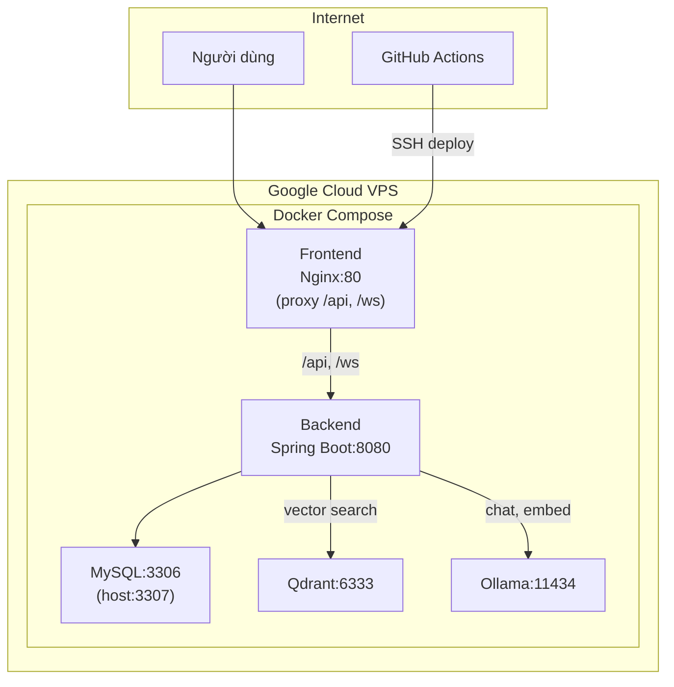

# Plan: Cập nhật Database nhom8_db → nhom8_db2 & Deploy Ollama/Qdrant lên VPS

## Tổng quan

Hai mục tiêu chính:
1. **Đồng bộ tất cả cấu hình** từ `nhom8_db` → `nhom8_db2` và sửa lỗi port MySQL (3307 vs 3306 trong Docker)
2. **Bật AI features (Chatbox + Vector Search)** trên production bằng cách thêm Ollama + Qdrant vào `docker-compose.prod.yml`

---

## Trạng thái hiện tại (Đã làm ✅ / Chưa đồng bộ ⚠️)

### Database `nhom8_db2` — _Chưa đồng bộ hết_

| File | DB Name | Port | Trạng thái |
|---|---|---|---|
| [.env (root)](file:///d:/2A2026/bookwebsite/.env) | `nhom8_db2` | `3307` | ✅ OK |
| [application.properties](file:///d:/2A2026/bookwebsite/ONLINE-STORY-READING-WEBSITE/src/main/resources/application.properties) | `nhom8_db2` | `3307` | ✅ OK |
| [application.properties.example](file:///d:/2A2026/bookwebsite/ONLINE-STORY-READING-WEBSITE/src/main/resources/application.properties.example) | `nhom8_db2` | `3307` | ✅ OK |
| [BE/.env](file:///d:/2A2026/bookwebsite/ONLINE-STORY-READING-WEBSITE/.env) | `nhom8_db2` | `3307` | ✅ OK |
| [BE/docker-compose.prod.yml](file:///d:/2A2026/bookwebsite/ONLINE-STORY-READING-WEBSITE/docker-compose.prod.yml) | `nhom8_db2` | `3307` | ✅ OK |
| **[docker-compose.prod.yml (root)](file:///d:/2A2026/bookwebsite/docker-compose.prod.yml)** | **`nhom8_db` (default)** | `3307` | ⚠️ **Sai default** |
| [indexer/.env](file:///d:/2A2026/bookwebsite/ONLINE-STORY-READING-WEBSITE/indexer/.env) | **`nhom8_db`** | `3307` | ⚠️ **Chưa đổi** |
| [README.md](file:///d:/2A2026/bookwebsite/ONLINE-STORY-READING-WEBSITE/README.md) | **`nhom8_db`** | `3307` | ⚠️ **Tài liệu cũ** |
| [PROJECT_BE_OVERVIEW.md](file:///d:/2A2026/bookwebsite/ONLINE-STORY-READING-WEBSITE/PROJECT_BE_OVERVIEW.md) | **`nhom8_db` @ 3306** | `3306` | ⚠️ **Tài liệu cũ** |

### AI/Chatbot — _Feature flags đang TẮT trên production_

| Item | Trạng thái |
|---|---|
| Feature flag code (Backend) | ✅ Đã implement |
| Feature flag code (Frontend ẩn ChatBox) | ✅ Đã implement |
| Fallback search → MySQL FULLTEXT | ✅ Đã implement |
| `docker-compose.prod.yml` có Qdrant/Ollama | ❌ Đã bị remove |
| Qdrant data (vectors) cần re-index | ❌ Chưa có trên VPS |

---

## User Review Required

> [!IMPORTANT]
> **Lỗi nghiêm trọng về MySQL port trong Docker:**
> MySQL container mặc định lắng nghe trên port **3306** (bên trong container). Tất cả các cấu hình đang kết nối tới port `3307` bên trong Docker network, nhưng MySQL chỉ listen trên `3306`.
>
> - Port mapping `3307:3307` → MySQL bên trong container không có gì lắng nghe trên 3307!
> - Port mapping đúng phải là `3307:3306` (host:container)
> - Bên trong Docker network (backend → mysql), phải dùng port **3306** (internal port)
> - `SPRING_DATASOURCE_URL` trong compose phải là `jdbc:mysql://mysql:3306/nhom8_db2`
>
> **Đây là lý do tại sao backend có thể không kết nối được DB trên production.**

> [!WARNING]
> **RAM VPS:** Ollama + Qdrant cần thêm ~3-4GB RAM. VPS e2-medium (4GB) có thể không đủ chạy tất cả (MySQL + Spring Boot + Ollama + Qdrant + Frontend). Bạn cần:
> - VPS ít nhất **8GB RAM**, hoặc
> - Ollama dùng model nhỏ hơn (`qwen2.5:1.5b` thay vì `3b`), hoặc
> - Cân nhắc chỉ deploy Qdrant trên VPS, giữ Ollama trên local kết nối qua tunnel

---

## Proposed Changes

### Phase 1: Sửa lỗi MySQL port + đồng bộ DB name

#### [MODIFY] [docker-compose.prod.yml (root)](file:///d:/2A2026/bookwebsite/docker-compose.prod.yml)
- Sửa port mapping MySQL: `3307:3307` → `3307:3306`
- Sửa default `SPRING_DATASOURCE_URL`: `mysql:3307/nhom8_db` → `mysql:3306/nhom8_db2`
- Thêm `MYSQL_TCP_PORT` không cần (MySQL mặc định 3306)

#### [MODIFY] [.env (root)](file:///d:/2A2026/bookwebsite/.env)
- Sửa `SPRING_DATASOURCE_URL`: `mysql:3307` → `mysql:3306` (cho Docker internal)
- Sửa `SPRING_DATASOURCE_USERNAME`: `nhom8_db` → `root` (match MYSQL_USER)

#### [MODIFY] [BE/docker-compose.prod.yml](file:///d:/2A2026/bookwebsite/ONLINE-STORY-READING-WEBSITE/docker-compose.prod.yml)
- Sửa port mapping: `3307:3307` → `3307:3306`
- Sửa `SPRING_DATASOURCE_URL`: `mysql:3307` → `mysql:3306`

#### [MODIFY] [indexer/.env](file:///d:/2A2026/bookwebsite/ONLINE-STORY-READING-WEBSITE/indexer/.env)
- Sửa `MYSQL_DB`: `nhom8_db` → `nhom8_db2`

---

### Phase 2: Thêm Ollama + Qdrant vào production compose

#### [MODIFY] [docker-compose.prod.yml (root)](file:///d:/2A2026/bookwebsite/docker-compose.prod.yml)
- Thêm service `qdrant` (image: `qdrant/qdrant:latest`)
- Thêm service `ollama` (image: `ollama/ollama:latest`)
- Thêm volumes: `qdrant_storage`, `ollama_data`
- Cập nhật backend `depends_on`: thêm qdrant
- Cập nhật env vars:
  - `QDRANT_URL=http://qdrant:6333` (internal Docker port)
  - `OLLAMA_URL=http://ollama:11434`
  - `APP_FEATURES_VECTOR_SEARCH_ENABLED=true`
  - `APP_FEATURES_AI_CHAT_ENABLED=true`
- Thêm `VITE_ENABLE_AI_CHAT=true` và `VITE_ENABLE_VECTOR_SEARCH=true` cho frontend build

#### [MODIFY] [.env (root)](file:///d:/2A2026/bookwebsite/.env)
- Cập nhật `QDRANT_URL=http://qdrant:6333`
- Cập nhật `OLLAMA_URL=http://ollama:11434`
- Thêm `APP_FEATURES_VECTOR_SEARCH_ENABLED=true`
- Thêm `APP_FEATURES_AI_CHAT_ENABLED=true`
- Thêm `VITE_ENABLE_AI_CHAT=true`
- Thêm `VITE_ENABLE_VECTOR_SEARCH=true`

---

### Phase 3: Cập nhật Dockerfile Backend (hỗ trợ JAVA_OPTS)

#### [MODIFY] [Backend Dockerfile](file:///d:/2A2026/bookwebsite/ONLINE-STORY-READING-WEBSITE/Dockerfile)
- Thêm `ENTRYPOINT` hỗ trợ `JAVA_OPTS` env var để có thể giới hạn RAM từ compose

---

### Phase 4: Thêm Nginx config cho Frontend (proxy API + WS)

#### [MODIFY] [Frontend Dockerfile](file:///d:/2A2026/bookwebsite/Fontend-ONLINE-STORY-READING-WEBSITE-/Dockerfile)
- Thêm `ARG` cho VITE env vars (truyền vào lúc build)
- Thêm `COPY nginx.conf` để proxy `/api` và `/ws` tới backend

#### [NEW] [nginx.conf (Frontend)](file:///d:/2A2026/bookwebsite/Fontend-ONLINE-STORY-READING-WEBSITE-/nginx.conf)
- Cấu hình reverse proxy `/api/` → `http://backend:8080/api/`
- Cấu hình WebSocket proxy `/ws/` → `http://backend:8080/ws/`
- SPA fallback `try_files $uri /index.html`

---

### Phase 5: Deploy & Index lại Vector data trên VPS

Sau khi deploy, cần thực hiện trên VPS:
1. Pull model Ollama: `docker exec ollama ollama pull nomic-embed-text && docker exec ollama ollama pull qwen2.5:3b`
2. Chạy indexer để tạo vector data: cần copy script `indexer/` lên VPS hoặc chạy từ local trỏ tới VPS

---

## Kiến trúc mới sau thay đổi



---

## Open Questions

> [!IMPORTANT]
> 1. **VPS của bạn có bao nhiêu RAM?** Ollama + Qdrant cần thêm ~3-4GB. Nếu VPS chỉ 4GB, nên upgrade lên 8GB hoặc chỉ deploy Qdrant (search), không deploy Ollama (chat).
> 2. **Bạn có muốn giữ cả 2 file compose** (`/docker-compose.prod.yml` ở root và `/ONLINE-STORY-READING-WEBSITE/docker-compose.prod.yml`)? File trong `ONLINE-STORY-READING-WEBSITE/` có vẻ là bản cũ, có thể xoá để tránh nhầm lẫn.
> 3. **Sau khi deploy Ollama, bạn muốn re-index vector data bằng cách nào?** Chạy script `qdrant_indexer.py` trực tiếp trên VPS hay từ local trỏ tới VPS qua public IP?

---

## Verification Plan

### Automated Tests
```bash
# 1. Validate compose config
docker compose -f docker-compose.prod.yml config

# 2. Test MySQL connectivity bên trong Docker
docker compose -f docker-compose.prod.yml exec backend sh -c "curl -sf http://mysql:3306 || echo 'MySQL port OK'"

# 3. Health check backend
curl -sf https://alexdev.software/api/stories

# 4. Health check Qdrant
curl -sf http://localhost:6333/collections

# 5. Health check Ollama  
curl -sf http://localhost:11434/api/tags
```

### Manual Verification
- Kiểm tra ChatBox hiển thị trên frontend production
- Thử tìm kiếm story trên production (vector search hoạt động)
- Thử chat với AI chatbot trên production
